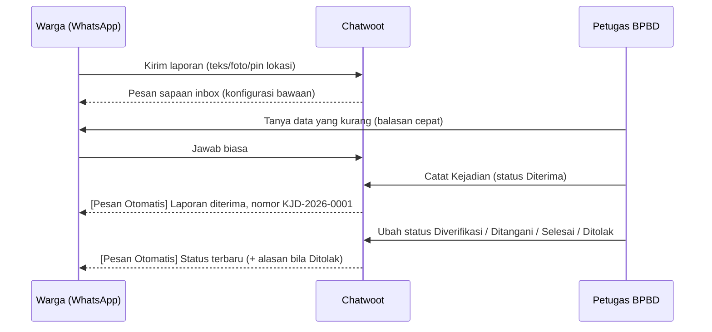
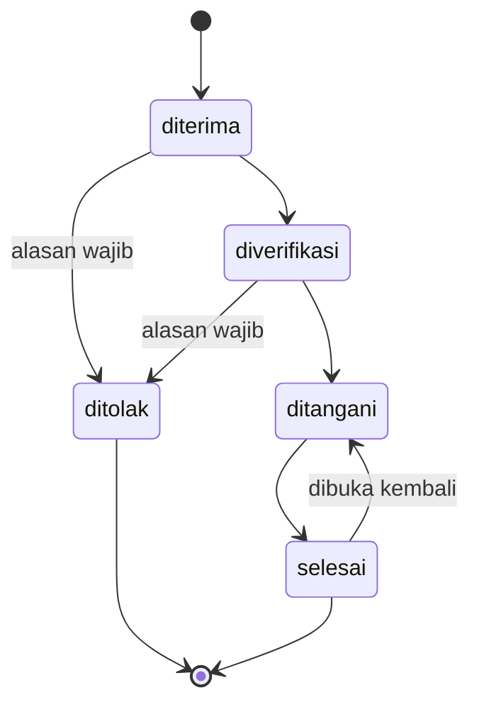

# Rencana Implementasi: Modul Laporan Kejadian (SINGABANA ON TIME)

- **Branch**: `feat/bpbd-laporan-kejadian` (dari `develop` @ `f617726ac`)
- **Status dokumen**: Rencana. Belum ada kode produksi yang diubah.
- **Rujukan kebutuhan**: `docs/bpbd-specific/analisis-kebutuhan-chatwoot.md` poin 2, 3, 4, 5 (dan 6 sebagai alur status).
- **Data wilayah**: `docs/bpbd-specific/data/wilayah-tanah-bumbu.json`. Berisi 12 kecamatan dan 157 desa/kelurahan beserta kode wilayah Kemendagri, diambil 2026-10-07 dari nomor.net (sumber tercantum di dalam file).

---

## 1. Tujuan dan Batasan

### Tujuan
Warga cukup chat WhatsApp seperti biasa. Petugas BPBD mencatat kejadian secara terstruktur dari layar chat. Setelah itu petugas dapat:
1. Melihat semua kejadian dalam satu tabel: jenis, lokasi, waktu, tingkat, pelapor, tim, dan status.
2. Membuka chat pelapor dari kejadian, dan sebaliknya.
3. Mengubah status penanganan. Setiap perubahan status otomatis dikirim ke semua pelapor dengan awalan `[Pesan Otomatis]`.
4. Mengekspor rekap ke CSV sebagai bahan kajian.

### Di luar lingkup
- Bot tanya-jawab otomatis untuk warga.
- Manajemen stok logistik (poin 7).
- Peta sebaran/GIS. Koordinat disimpan dan ditampilkan sebagai tautan Google Maps saja.
- Dashboard statistik grafis. Rekap dilakukan lewat filter tabel dan CSV.
- Realtime ActionCable untuk daftar kejadian. Data dimuat ulang saat halaman/panel dibuka, mengikuti modul `Company`, `Note`, dan `Macro` yang juga tidak memakai realtime.

### Keputusan yang sudah disepakati

| No | Keputusan |
|---|---|
| 1 | Status: Diterima, Diverifikasi, Ditangani, Selesai, Ditolak. Status Ditolak wajib menyertakan alasan. |
| 2 | Satu kejadian bisa punya banyak pelapor: chat lain dapat ditautkan ke kejadian yang sudah ada. |
| 3 | Setiap perubahan status otomatis mengirim pesan ke pelapor. Template disediakan oleh kita dan diawali `[Pesan Otomatis]`. |
| 4 | Kecamatan dan desa memakai daftar baku Kab. Tanah Bumbu. |
| 5 | Jenis kejadian dan tingkat kedaruratan mengikuti usulan di dokumen analisis. |
| 6 | Semua petugas boleh mencatat dan mengubah status. Hanya admin yang boleh menghapus dan mengekspor. |

---

## 2. Hasil Pemetaan Codebase (graphify + codegraph)

| Area | Temuan | Anchor |
|---|---|---|
| Nomor urut per akun | Sequence PostgreSQL per akun dibuat oleh trigger `hairtrigger`. Insert memakai `nextval`. | `app/models/account.rb:211-217`, `app/models/campaign.rb:163-165`, `app/models/conversation.rb:433-435`, `Conversation#load_attributes_created_by_db_triggers` |
| Pembersihan sequence | Saat akun dihapus, sequence ikut di-drop. | `Account#remove_account_sequences` (`account.rb:239-242`) |
| Controller CRUD akun | Pola `Company`: `before_action :check_authorization`, Kaminari `RESULTS_PER_PAGE = 25`, jbuilder `meta` + `payload`. | `app/controllers/api/v1/accounts/companies_controller.rb` |
| Controller nested di percakapan | `Current.account.conversations.find_by!(display_id:)` + `authorize @conversation, :show?` | `app/controllers/api/v1/accounts/conversations/base_controller.rb` |
| Policy | `ApplicationPolicy` dengan `@account_user.administrator?` / `agent?`. Ekspor khusus admin. | `app/policies/contact_policy.rb:14`, `enterprise/app/policies/enterprise/contact_policy.rb` |
| CSV sinkron | ERB `.csv.erb` dengan `CSVSafe.generate_line` (aman dari formula injection). | `app/views/api/v1/accounts/csat_survey_responses/download.csv.erb` |
| Feature flag | `config/features.yml`. Kolom `feature_flags` sudah penuh; flag baru masuk `column: feature_flags_ext_1`. Flag diaktifkan untuk akun lama lewat migrasi `enable_features!`. | `app/models/concerns/featurable.rb`, `db/migrate/20260120121402_enable_captain_tasks_for_existing_accounts.rb` |
| Pengiriman pesan keluar | `Messages::MessageBuilder.new(user, conversation, params).perform`. `Message#after_create_commit` memanggil `SendReplyJob`, yang meneruskan ke layanan kanal. | `app/builders/messages/message_builder.rb`, `app/models/message.rb:139,406-409`, `app/jobs/send_reply_job.rb` |
| Jendela 24 jam WA | `Conversation#can_reply?` memanggil `Conversations::MessageWindowService`. Untuk `Channel::Whatsapp`, pesan biasa di luar 24 jam ditandai `failed` dengan `external_error`. | `app/services/whatsapp/send_on_whatsapp_service.rb:10-18`, `app/services/conversations/message_window_service.rb` |
| Template WA | `template_params` (`name`, `language`, `processed_params.body`). `TEMPLATE_PARAMS_SCHEMA` hanya mewajibkan `name`. `TemplateProcessorService#find_template` mencari template `approved`, tetapi bila tidak ketemu, nama template tetap diteruskan ke Meta tanpa parameter (`template_processor_service.rb:12-31`). Pengecekan template approved harus dilakukan sendiri (§6.4). | `app/models/message.rb:48-66`, `app/services/whatsapp/template_processor_service.rb` |
| Error otorisasi | `Pundit::NotAuthorizedError` dirender sebagai **401** | `app/controllers/concerns/request_exception_handler.rb:24-26` |
| Serialisasi lampiran | Partial `_attachment.json.jbuilder` (dipakai endpoint attachments) tidak memuat koordinat lokasi | `app/views/api/v1/models/_attachment.json.jbuilder:1-13` |
| Date picker | `components/ui/DateTimePicker.vue` menolak tanggal sebelum kemarin dan tidak bisa diketik. Tidak cocok untuk waktu kejadian. | `components/ui/DateTimePicker.vue:26-29,40,44` |
| Kanal API (Evolution/WAHA) | Pesan keluar dikirim ke gateway lewat `WebhookListener` menuju `channel.webhook_url`. Tidak ada jendela 24 jam kecuali `agent_reply_time_window` diset. | `app/listeners/webhook_listener.rb:123-127` |
| Metrik respons | `Message#human_response?` hanya bernilai true jika `sender.is_a?(User)`. Pesan dengan `sender: nil` tidak mengganggu FRT/SLA dan tampil sebagai bubble Bot. | `app/models/message.rb:369`, `components-next/message/Message.vue` |
| Liquid | Konten pesan `outgoing`/`template` di-render Liquid saat `before_create`. | `app/models/concerns/liquidable.rb:4-41` |
| Catatan aktivitas | Pesan `message_type: :activity` lewat `Conversations::ActivityMessageJob`. Tidak dikirim ke WA dan diabaikan oleh automation rule. | `app/jobs/conversations/activity_message_job.rb`, `app/listeners/automation_rule_listener.rb` |
| Lampiran lokasi | `Attachment` punya `coordinates_lat`, `coordinates_long`, `fallback_title` (file_type `location`). Endpoint `GET conversations/:id/attachments`. | `app/models/attachment.rb:6-10,139-146`, `ConversationsController#attachments` |
| Panel kanan chat | Accordion draggable di `ContactPanel.vue`. Urutan default di `DEFAULT_CONVERSATION_SIDEBAR_ITEMS_ORDER`; item baru otomatis digabung ke preferensi tersimpan. | `routes/dashboard/conversation/ContactPanel.vue`, `composables/useUISettings.js:5-16` |
| Sidebar & route | `menuItems` di `components-next/sidebar/Sidebar.vue`. Gating lewat `meta.permissions` dan `meta.featureFlag` pada route. | `components-next/sidebar/Sidebar.vue`, `components-next/sidebar/provider.js`, `routes/dashboard/companies/routes.js` |
| Store frontend | Modul baru memakai Pinia: `createStore({ type: 'pinia', API })`. | `store/storeFactory.js`, `stores/companies.js`, `api/ApiClient.js` |
| Komponen UI | `BaseTable`/`BaseTableRow`/`BaseTableCell`, `Dialog`, `Input`, `TextArea`, `Select`, `ComboBox`, `PaginationFooter`, `DateTimePicker`, `MultiselectDropdown` (agen/tim). | `components-next/*`, `components/ui/DateTimePicker.vue`, `ConversationAction.vue` |
| i18n | Default locale fork ini `id` (`config/application.rb`, `entrypoints/dashboard.js`). Fork ini memelihara `id/*.json` dan `config/locales/id.yml`. | `i18n/locale/{en,id}/index.js` |
| Relasi yang terdampak penghapusan | `Team has_many :conversations, dependent: :nullify`. `Agents::DestroyJob#unassign_conversations`. `Conversation has_many :messages, dependent: :destroy_async`. `Message has_many :attachments, dependent: :destroy`. | `app/models/team.rb:26`, `app/jobs/agents/destroy_job.rb:32-40`, `conversation.rb:128`, `message.rb:135` |
| Tes | Request spec di `spec/controllers/api/v1/accounts/*_controller_spec.rb` (`type: :request`), factory di `spec/factories`. DB tes `chatwoot_test` dengan transactional fixtures. Playwright `baseURL` default `http://localhost:3000`. | `config/database.yml:23`, `spec/rails_helper.rb:46`, `tests/playwright/playwright.config.ts:21` |

Tidak ditemukan model, tabel, atau route bernama incident/kejadian yang sudah ada. Modul ini dibangun baru.

---

## 3. Alur Pengguna

### 3.1 Masyarakat



Warga tidak mengisi formulir, tidak memasang aplikasi, dan tidak mengikuti menu bot.

### 3.2 Petugas

1. **Terima**: notifikasi chat baru (bawaan). Buka chat, baca pesan, foto, dan pin lokasi.
2. **Catat**: di panel kanan chat ada bagian **Laporan Kejadian**.
   - Jika chat belum tertaut ke kejadian, tersedia dua tombol: **Catat Kejadian Baru** dan **Tautkan ke Kejadian Lain**. Tombol tautkan membuka pencarian berdasarkan nomor, desa, atau jenis.
   - Jika chat sudah tertaut, panel menampilkan ringkasan kejadian (nomor, jenis, lokasi, status), tombol **Ubah Status**, **Edit**, dan **Buka Detail**.
3. **Isi form** (Dialog):

| Isian | Wajib | Sumber/Komponen |
|---|:---:|---|
| Jenis kejadian | Ya | `Select`, daftar tetap |
| Waktu kejadian | Ya | `vue-datepicker-next` `type="datetime"` langsung. **Bukan** `components/ui/DateTimePicker.vue`, karena komponen itu menolak tanggal sebelum kemarin (`disableBeforeToday`) dan tidak bisa diketik (`:editable="false"`). Tanggal masa depan dinonaktifkan. Default dari field server `first_incoming_at` (§5). Input ditafsirkan sebagai WITA dan dikirim ke API sebagai ISO 8601 dengan offset `+08:00`. |
| Kecamatan | Ya | `Select`, 12 kecamatan |
| Desa/Kelurahan | Ya | `ComboBox` yang disaring sesuai kecamatan |
| Alamat/patokan | Tidak | `Input` |
| Koordinat (lat, long) | Tidak | Tombol **Ambil dari pin lokasi** (lampiran `file_type: location` dari endpoint attachments, yang diperluas di §7.2), atau input manual |
| Tingkat kedaruratan | Ya | `Select`, daftar tetap |
| Jumlah korban (meninggal, luka, mengungsi, terdampak) | Tidak | `Input` angka |
| Kebutuhan penanganan | Tidak | `TextArea` |
| Foto bukti | Tidak | Grid lampiran gambar/video di chat yang bisa dicentang |
| Tim & penanggung jawab | Tidak | `MultiselectDropdown` tim dan agen. Server me-resolve lewat `Current.account.teams` / `Current.account.users` (§5). |
| Catatan | Tidak | `TextArea` |

4. **Simpan**: sistem memberi nomor `KJD-<tahun>-<urut 4 digit>` dengan status **Diterima**. Pesan otomatis "laporan diterima" dikirim ke pelapor, dan catatan aktivitas ditambahkan di chat.
5. **Ubah status**: lewat dialog **Ubah Status**. Hanya transisi yang valid yang muncul. Alasan wajib diisi untuk **Ditolak**; catatan opsional untuk status lain. Setiap perubahan memicu riwayat status, pesan otomatis ke semua pelapor, dan catatan aktivitas di setiap chat pelapor.
6. **Pantau**: menu sidebar **Kejadian** berisi tabel, filter, dan tombol **Ekspor CSV** (khusus admin). Klik baris membuka detail: data lengkap, galeri foto, tautan peta, timeline status, daftar pelapor dengan tombol **Buka Chat**, dan status pengiriman pesan otomatis per pelapor.

### 3.3 Diagram status



- `Ditolak` bersifat final. Untuk laporan yang ternyata valid, petugas membuat kejadian baru atau menautkan ke kejadian lain.
- Status kejadian tidak mengubah status percakapan, dan sebaliknya.

---

## 4. Desain Data

Mengikuti AGENTS.md, tidak memakai foreign key database. Relasi dijaga dengan asosiasi dan callback Rails. Semua index komposit diawali `account_id`.

### 4.1 Tabel `incidents`

| Kolom | Tipe | Catatan |
|---|---|---|
| `id` | bigint PK | |
| `account_id` | bigint, not null | index |
| `display_id` | integer, not null | dari sequence `incident_dpid_seq_<account_id>`; unique `[account_id, display_id]` |
| `category` | integer enum, not null | `banjir, karhutla, tanah_longsor, puting_beliung, gelombang_pasang, gempa_bumi, lainnya` |
| `emergency_level` | integer enum, not null | `siaga_darurat, tanggap_darurat, transisi_darurat` |
| `status` | integer enum, not null, default `diterima` | `diterima, diverifikasi, ditangani, selesai, ditolak` |
| `occurred_at` | datetime, not null | |
| `kecamatan_code` | string, not null | contoh `63.10.06`; divalidasi terhadap data wilayah |
| `desa_code` | string, not null | contoh `63.10.06.2001`; wajib berada di kecamatan terkait |
| `address` | string(255) | patokan lokasi |
| `latitude`, `longitude` | decimal(10,7) | opsional; validasi rentang -90..90 / -180..180, wajib berpasangan |
| `casualties` | jsonb, default `{}` | kunci tetap: `meninggal, luka, mengungsi, terdampak` (integer ≥ 0) |
| `needs` | text | kebutuhan penanganan |
| `notes` | text | |
| `rejection_reason` | text | wajib saat `ditolak` |
| `team_id` | bigint | nullable |
| `assignee_id` | bigint | nullable (User) |
| `created_by_id` | bigint | User pencatat |
| `status_changed_at` | datetime | |
| `created_at`, `updated_at` | | |

Index: `[account_id, display_id]` unique, `[account_id, status]`, `[account_id, occurred_at]`, `[account_id, category]`, `[account_id, kecamatan_code]`, `team_id`, `assignee_id`.

Nomor tampilan dihitung dari data, bukan disimpan: `format('KJD-%<year>d-%<id>04d', year: created_at.year, id: display_id)`. Urutan `display_id` berjalan terus per akun dan tidak di-reset tiap tahun, sehingga nomor selalu unik.

`display_id` diisi oleh trigger database, jadi objek Ruby belum mengetahuinya setelah `INSERT`. `Incidents::CreateService` memanggil `incident.reload` tepat setelah insert, di dalam transaksi, sebelum menulis riwayat/aktivitas atau me-render respons. Ini setara dengan `Conversation#load_attributes_created_by_db_triggers` (`conversation.rb:143,376-379`) dan `Campaign` (`campaign.rb:58,112-114`). Trigger hasil `rake db:generate_trigger_migration` wajib ikut ter-dump di `db/schema.rb` (blok trigger yang ada di `schema.rb:1713-1740`).

### 4.2 Tabel `incident_reports` (tautan kejadian ↔ chat pelapor)

| Kolom | Tipe | Catatan |
|---|---|---|
| `id` | bigint PK | |
| `account_id` | bigint, not null | |
| `incident_id` | bigint, not null | |
| `conversation_id` | bigint, not null | unique: satu chat hanya untuk satu kejadian |
| `linked_by_id` | bigint | User |
| `created_at`, `updated_at` | | |

Pelapor dibaca dari `conversation.contact`, tidak disalin ke tabel ini. Dengan begitu merge atau edit kontak otomatis tercermin, dan tidak perlu sinkronisasi saat `ContactMergeAction`.

### 4.3 Tabel `incident_status_changes` (timeline)

| Kolom | Tipe | Catatan |
|---|---|---|
| `id` | bigint PK | |
| `account_id`, `incident_id` | bigint, not null | index `[incident_id, created_at]` |
| `kind` | integer enum, not null | `created, status_changed, linked`; menjadi kunci notifikasi (§6.3) |
| `from_status` | integer, nullable | null untuk `created` |
| `to_status` | integer, not null | untuk `linked` sama dengan status saat ditautkan |
| `conversation_id` | bigint, nullable | diisi untuk `linked` (chat yang ditautkan) |
| `note` | text | alasan penolakan atau catatan |
| `user_id` | bigint | pelaku |
| `created_at` | datetime | |

Tabel khusus ini dipakai karena `audited` hanya aktif di audit log Enterprise. Riwayat status harus bisa dibaca di edisi OSS.

### 4.4 Tabel `incident_attachments` (foto bukti)

| Kolom | Tipe | Catatan |
|---|---|---|
| `id` | bigint PK | |
| `account_id`, `incident_id`, `attachment_id` | bigint, not null | unique `[incident_id, attachment_id]` |
| `created_at` | datetime | |

Validasi: lampiran harus berasal dari chat yang tertaut ke kejadian (`attachment.message.conversation_id ∈ incident.conversation_ids`) dan bertipe `image` atau `video`.

Pelepasan tautan chat, baik manual maupun karena chat dihapus, selalu lewat satu method `IncidentReport#detach!`. Method ini menghapus `incident_attachments` milik kejadian tersebut yang berasal dari chat itu, dalam transaksi yang sama. Penghapusan chat memanggilnya dari `before_destroy` di `Conversation`, karena pesan/lampiran dihapus asinkron (`conversation.rb:128` `destroy_async`) dan galeri tidak boleh menampilkan bukti dari chat yang sudah tidak tertaut.

### 4.5 Asosiasi dan penghapusan

| Model | Tambahan | Alasan |
|---|---|---|
| `Account` | `has_many :incidents, dependent: :destroy_async` + trigger `incident_dpid_seq_%s` + drop sequence di `remove_account_sequences` | sama dengan pola `campaigns` |
| `Incident` | `has_many :incident_reports, :incident_status_changes, :incident_attachments, dependent: :delete_all`; `has_many :conversations, through: :incident_reports` | |
| `Conversation` | `has_one :incident_report` + `before_destroy` yang memanggil `incident_report&.detach!`; `has_one :incident, through: :incident_report` | menghapus chat melepas tautan dan foto buktinya, kejadian tetap ada |
| `Attachment` | `has_many :incident_attachments, dependent: :delete_all` | menghapus pesan/lampiran tidak meninggalkan baris yatim |
| `Team` | `has_many :incidents, dependent: :nullify` | sama dengan `conversations` (`team.rb:26`) |
| `User` | `has_many :assigned_incidents, foreign_key: :assignee_id, dependent: :nullify`; relasi `created_by`, `linked_by`, dan `user` di riwayat status juga `dependent: :nullify` | sama dengan `assigned_conversations` (`user.rb:91`). Serializer menampilkan "Pengguna dihapus" bila aktor null. |
| `Agents::DestroyJob` | `unassign_incidents` (update `assignee_id: nil` untuk akun tersebut) | pelepasan keanggotaan akun, sama dengan `unassign_conversations` (`destroy_job.rb:32-40`) |

### 4.6 Data referensi

| File | Isi |
|---|---|
| `config/bpbd/wilayah_tanah_bumbu.json` | dipindah dari `docs/bpbd-specific/data/wilayah-tanah-bumbu.json` |
| `config/bpbd/incident_notification_templates.yml` | template pesan otomatis per status (§6) |

Loader `Bpbd::Wilayah` memuat JSON sekali (`.freeze`), sama seperti `Featurable::FEATURE_LIST`. Fungsinya: `kecamatan`, `desa_for(kecamatan_code)`, `valid_pair?(kec, desa)`, `name_for(code)`. Frontend mengambil data yang sama lewat `GET /api/v1/accounts/:id/incidents/regions` agar tidak ada salinan kedua di JS.

Label jenis, tingkat, dan status (Indonesia/Inggris) ada di `config/locales/{id,en}.yml` (backend, untuk CSV dan pesan) serta `i18n/locale/{id,en}/incidents.json` (frontend).

---

## 5. API

Semua endpoint di bawah `api/v1/accounts/:account_id`, memakai `Api::V1::Accounts::BaseController`, `Current.account`, dan Pundit.

| Method | Path | Fungsi | Policy |
|---|---|---|---|
| GET | `/incidents` | daftar + filter `status[]`, `category[]`, `emergency_level[]`, `kecamatan_code`, `desa_code`, `team_id`, `assignee_id`, `occurred_from`, `occurred_to`, `q` (nomor/alamat), `page`; urut `occurred_at desc` | `index?` |
| GET | `/incidents/:id` | detail + pelapor + foto + timeline + status kirim notifikasi per pelapor | `show?` |
| POST | `/incidents` | buat dari chat; body wajib berisi `conversation_id` (display_id chat) | `create?` |
| PATCH | `/incidents/:id` | edit data (tidak termasuk status) | `update?` |
| DELETE | `/incidents/:id` | hapus | `destroy?` (admin) |
| POST | `/incidents/:id/status` | ubah status `{ status, note }` | `authorize @incident, :change_status?` |
| POST | `/incidents/:id/reports` | tautkan chat `{ conversation_id }` | `authorize @incident, :link?` |
| DELETE | `/incidents/:id/reports/:conversation_id` | lepas tautan, kecuali chat terakhir | `authorize @incident, :link?` |
| GET | `/incidents/download` | CSV sesuai filter yang sama | `download?` (admin) |
| GET | `/incidents/regions` | data kecamatan/desa | `authorize Incident, :index?` |
| GET | `/conversations/:conversation_id/incident` | kejadian yang tertaut ke chat + `first_incoming_at` chat (untuk default waktu kejadian), `incident: null` bila belum tertaut | `authorize @conversation, :show?` (dari `Conversations::BaseController`) |

Otorisasi:
- `IncidentsController` memakai `check_authorization` bawaan (`Api::BaseController`), yang menebak policy dari `controller_name`. Controller nested `Incidents::StatusController` dan `Incidents::ReportsController` **tidak** memakai `check_authorization`. Keduanya memanggil `authorize(@incident, :change_status?)` / `authorize(@incident, :link?)` secara eksplisit, supaya `reports#destroy` tidak jatuh ke `destroy?` yang khusus admin.
- Penolakan Pundit memakai handler yang ada (`request_exception_handler.rb:24-26`) dan menghasilkan **401**, sama seperti spec `companies_controller_spec.rb` untuk agen. Feature flag mati menghasilkan **403** (§ di bawah).

Aturan validasi di batas request (422 dengan error yang sudah ada):
- Nilai enum di luar daftar, pasangan kecamatan-desa yang tidak cocok, koordinat yang hanya terisi sebelah, `occurred_at` di masa depan, transisi status tidak valid, `ditolak` tanpa `note`, `attachment_ids` di luar chat yang tertaut, dan `conversation_id` yang sudah tertaut ke kejadian lain.
- `team_id` dan `assignee_id` di-resolve lewat `Current.account.teams.find_by(id:)` / `Current.account.users.find_by(id:)`. ID yang tidak ditemukan menghasilkan 422, sama seperti cara `Conversations::AssignmentService` me-resolve user (`assignment_service.rb:48-49`). `created_by_id`, `linked_by_id`, dan `user_id` riwayat selalu diambil dari `Current.user`, tidak pernah dari parameter.
- Pengaksesan chat saat membuat atau menautkan selalu lewat `Current.account.conversations.find_by!(display_id:)` + `authorize conversation, :show?`. Agen tidak bisa menautkan chat dari inbox yang tidak ia akses.

Konkurensi: perubahan status dan pelepasan tautan dijalankan di dalam `incident.with_lock`. Status saat ini dan jumlah pelapor dibaca ulang di dalam lock sebelum validasi transisi, penulisan riwayat, atau pengecekan "chat terakhir". Dua petugas yang mengubah status bersamaan tidak bisa menghasilkan transisi ganda dari status yang sama, dan dua permintaan lepas tautan tidak bisa menghapus semua pelapor. Pola sama dengan `Conversations::AssignmentService` (`assignment_service.rb:17-25`).

`first_incoming_at` dihitung di server: `conversation.messages.incoming.minimum(:created_at)`. Nilai `null` bila belum ada pesan masuk, dan form lalu memakai waktu sekarang. Data ini tidak bisa diambil dari daftar pesan di frontend karena `MessageFinder` hanya memuat 20 pesan terakhir.

Visibilitas: daftar kejadian dapat dilihat semua agen di akun karena kejadian adalah data operasional bersama. Tombol **Buka Chat** tetap mengikuti izin inbox, sehingga agen tanpa akses inbox melihat data pelapor tetapi tidak bisa membuka chatnya.

Feature flag: `bpbd_incidents` di `config/features.yml` (`column: feature_flags_ext_1`, `enabled: true`). Ditambah migrasi data yang mengaktifkannya untuk akun yang sudah ada. Semua controller kejadian memakai `before_action :ensure_incidents_enabled!` dengan pola `CompaniesController#ensure_companies_enabled!` (`companies_controller.rb:76-80`, respons 403).

Enterprise (custom role): `Enterprise::AccountUser#permissions` mengganti peran dasar dengan `custom_role.permissions + ['custom_role']` (`enterprise/app/models/enterprise/account_user.rb:2-3`). Karena itu:
- Route frontend memakai `permissions: ['administrator', 'agent', 'custom_role']`, sehingga pengguna custom role tetap bisa membuka menu Kejadian.
- `IncidentPolicy` mendasarkan izin pada `@account_user.role` (`administrator?` / `agent?`), bukan pada `permissions`. Custom role diperlakukan sesuai peran dasarnya.
- Tombol khusus admin (hapus, ekspor) di frontend memakai `useAdmin().isAdmin` (peran dasar administrator), bukan `checkPermissions`, agar custom role tidak otomatis mendapat akses ekspor/hapus.
- Izin khusus `incident_manage` di `CustomRole::PERMISSIONS` adalah pengembangan lanjutan, bukan bagian rencana ini.

---

## 6. Pesan Otomatis ke Pelapor

### 6.1 Pemicu

| Peristiwa | Penerima |
|---|---|
| Kejadian dibuat (status `diterima`) | chat pembuat |
| Chat baru ditautkan | chat yang ditautkan (berisi status saat ini) |
| Status berubah ke status apa pun | semua chat yang tertaut |

Edit data tanpa perubahan status tidak mengirim pesan.

### 6.2 Template (disediakan kita, bukan diisi petugas)

`config/bpbd/incident_notification_templates.yml`, contoh:

```yaml
diterima: |-
  [Pesan Otomatis]
  Laporan Anda telah kami terima dengan nomor %{nomor}.
  Jenis: %{jenis}
  Lokasi: Desa %{desa}, Kec. %{kecamatan}
  Petugas BPBD Kab. Tanah Bumbu akan segera memverifikasi laporan Anda.
diverifikasi: |-
  [Pesan Otomatis]
  Laporan %{nomor} telah diverifikasi oleh petugas BPBD Kab. Tanah Bumbu dan sedang disiapkan penanganannya.
ditangani: |-
  [Pesan Otomatis]
  Laporan %{nomor} sedang ditangani. Tim BPBD Kab. Tanah Bumbu telah diterjunkan.
selesai: |-
  [Pesan Otomatis]
  Penanganan laporan %{nomor} telah selesai. Terima kasih atas laporan Anda.
ditolak: |-
  [Pesan Otomatis]
  Mohon maaf, laporan %{nomor} tidak dapat kami tindak lanjuti.
  Alasan: %{alasan}
```

- Interpolasi memakai `format` Ruby dengan kunci tetap. Petugas tidak bisa menyisipkan Liquid.
- `Liquidable` me-render Liquid pada konten outgoing (`before_create`, `liquidable.rb:6,26-41`) dan juga pada setiap nilai string di `template_params.processed_params` (`liquidable.rb:70-81,100-130`). Satu helper `Incidents::NotificationText.sanitize` menghapus penanda Liquid `{{`, `}}`, `` dari semua isian bebas petugas (`alasan`, catatan) dan dari nama desa/kecamatan. Helper ini dipakai baik untuk konten pesan biasa maupun parameter template WA (§6.4). Proteksi backtick bawaan `modified_liquid_content` tidak diandalkan.
- Loader memvalidasi saat boot bahwa setiap status memiliki template dan setiap template diawali `[Pesan Otomatis]`. Bila tidak, aplikasi gagal start (kesalahan konfigurasi harus ketahuan saat deploy).

### 6.3 Mekanisme kirim

Setiap notifikasi terikat ke **satu baris riwayat status** (`incident_status_changes`) yang tidak berubah, bukan ke status kejadian saat job berjalan. Dengan begitu, bila status berubah lagi sebelum job sebelumnya berjalan, setiap transisi tetap terkirim dengan isinya sendiri dan tidak ada pesan ganda untuk status terbaru.

Alur:
1. Service create/status/link menulis baris `incident_status_changes` di dalam lock (§5). Penautan chat menulis baris riwayat dengan `from_status = to_status = status saat ini` dan `kind: linked`; kolom `kind` (`created, status_changed, linked`) ditambahkan ke §4.3.
2. Setelah commit, service meng-enqueue `Incidents::NotifyReporterJob.perform_later(status_change_id, conversation_id)` untuk tiap penerima. Daftar penerima diambil saat commit: semua chat tertaut untuk `created`/`status_changed`, atau chat yang baru ditautkan untuk `linked`. Satu job per chat, supaya kegagalan satu kanal tidak menghentikan kanal lain. Job memakai `queue_as :high`, sama dengan `SendReplyJob` dan `Conversations::ActivityMessageJob`. Tidak ada nama antrean baru, jadi `config/sidekiq.yml` tidak perlu diubah.
3. Job me-render template dari `status_change.to_status` dan `status_change.note`, lalu membuat pesan:

```ruby
Messages::MessageBuilder.new(nil, conversation, {
  content: rendered_template,
  message_type: 'outgoing',
  private: false,
  content_attributes: { incident_status_change_id: status_change.id }
}).perform
```

4. Detail kejadian menampilkan status kirim per pelapor: untuk setiap chat tertaut, pesan terbaru dengan `content_attributes->>'incident_status_change_id'` milik kejadian itu, beserta `status` dan `external_error`-nya. `content_attributes` disimpan sebagai JSON utuh (`store :content_attributes, coder: JSON`, `message.rb:112-114`), jadi kunci di luar daftar `accessors` tetap tersimpan.

Efek samping pesan outgoing yang sudah ada dan tetap berlaku:
- `user: nil` (dan `message_type: 'outgoing'`) menghasilkan `sender: nil` (`message_builder.rb:134-135`). `human_response?` bernilai false (`message.rb:369`), sehingga metrik first response time dan SLA tidak tercemar, `waiting_since` tidak di-reset, dan bubble tampil sebagai Bot.
- Pesan ini **tetap** `notifiable?` (`message_filter_helpers.rb:16-18`), jadi assignee dan peserta chat menerima notifikasi pesan baru (`new_message_notification_service.rb:5-25`). Perilaku ini dianggap benar karena petugas yang memegang chat tahu warga sudah dikabari.
- Pesan ini **tetap** mencapai automation rule `message_created` (`automation_rule_listener.rb:18-34`). Rule yang memfilter `message_type = incoming` (pola umum) tidak terpengaruh. Spec regresi memastikan rule `message_created` dengan filter `outgoing` tidak membuat loop dengan pesan kejadian.
- `MessageBuilder` memicu `SendReplyJob`. Untuk `Channel::Api` (Evolution/WAHA), pengiriman ke gateway berjalan lewat `WebhookListener` (`webhook_listener.rb:123-127`).

### 6.4 Jendela 24 jam (WhatsApp Cloud API resmi)

Di `Channel::Whatsapp`, pesan biasa yang dikirim lebih dari 24 jam setelah pesan terakhir warga akan ditandai `failed` (`send_on_whatsapp_service.rb:17`). Penanganan di `Incidents::NotifyReporterJob`:

1. Jika `conversation.can_reply?` → kirim pesan biasa (template YAML).
2. Jika tidak, dan kanal `Channel::Whatsapp`:
   - Cari template approved secara eksplisit: `channel.message_templates.find { |t| t['name'] == 'singabana_status_kejadian' && t['language'] == 'id' && t['status'].casecmp?('approved') }`.
   - **Ada** → kirim dengan `message_type: 'outgoing'` (bukan `'template'`, karena `MessageBuilder` mengisi `sender` dengan kontak untuk tipe `template`, `message_builder.rb:134-135`) ditambah `template_params` di tingkat atas params:
     ```ruby
     template_params: {
       name: 'singabana_status_kejadian', language: 'id', category: 'UTILITY',
       processed_params: { body: { '1' => nomor, '2' => label_status, '3' => keterangan_tersanitasi } }
     }
     ```
     `SendOnWhatsappService` memilih jalur template berdasarkan adanya `template_params` (`send_on_whatsapp_service.rb:10-13`), bukan dari enum `message_type`.
   - **Tidak ada** → pesan tetap dibuat (agar riwayat kirim lengkap), lalu langsung di-update `status: :failed` dengan `external_error` berisi pesan i18n "Di luar jendela 24 jam dan template singabana_status_kejadian belum disetujui". Pemeriksaan ini harus eksplisit: `TemplateProcessorService` tetap mengembalikan nama template meskipun tidak ditemukan versi approved (`template_processor_service.rb:12-31`), sehingga tanpa pemeriksaan ini permintaan tetap terkirim ke Meta dan gagal di sisi provider.
3. Panel detail kejadian menampilkan status kirim per pelapor (§6.3 langkah 4), sehingga petugas tahu warga mana yang belum menerima kabar.

Kanal `Channel::Api` (Evolution API/WAHA) tidak memiliki jendela 24 jam di Chatwoot kecuali `agent_reply_time_window` diset, sehingga langkah 1 berlaku. Kegagalan di gateway hanya terlihat jika gateway memanggil balik `PATCH .../messages/:id` dengan `status: failed`.

### 6.5 Catatan aktivitas di chat

Setiap pencatatan, penautan, dan perubahan status juga menulis pesan `activity` lewat `Conversations::ActivityMessageJob`. Contoh: "Kejadian KJD-2026-0001 diubah ke Ditangani oleh Budi". Pesan ini hanya terlihat petugas, tidak dikirim ke WA, dan diabaikan automation rule (`automation_rule_listener.rb:105-108`).

---

## 7. Frontend

### 7.1 Berkas baru

| Berkas | Isi |
|---|---|
| `api/incidents.js` | `IncidentsAPI extends ApiClient('incidents', { accountScoped: true })` + `updateStatus`, `linkConversation`, `unlinkConversation`, `download`, `regions`, `forConversation` |
| `stores/incidents.js` | `createStore({ name: 'incidents', type: 'pinia', API: IncidentsAPI, actions: () => ({ updateStatus, link, unlink }) })`. `name` wajib karena `createPiniaStore` memanggil `name.toLowerCase()` (`storeFactory.js:136-139`). Contoh: `stores/companies.js`. |
| `routes/dashboard/incidents/routes.js` | `incidents_dashboard_index`, `incidents_dashboard_show`; `meta: { featureFlag: FEATURE_FLAGS.BPBD_INCIDENTS, permissions: ['administrator', 'agent', 'custom_role'] }` + `beforeEnter` yang mengalihkan ke dashboard bila flag akun mati |
| `routes/dashboard/incidents/pages/IncidentsIndex.vue` | tabel `BaseTable`, filter bar, `PaginationFooter`, tombol ekspor yang tampil hanya bila `useAdmin().isAdmin` |
| `routes/dashboard/incidents/pages/IncidentDetail.vue` | data, galeri, tautan peta, timeline, pelapor + status kirim, aksi (hapus hanya `isAdmin`) |
| `routes/dashboard/incidents/components/IncidentFormDialog.vue` | form §3.2, memakai `vue-datepicker-next` langsung untuk waktu kejadian |
| `routes/dashboard/incidents/components/IncidentStatusDialog.vue` | transisi valid + alasan/catatan |
| `routes/dashboard/incidents/components/IncidentLinkDialog.vue` | cari dan tautkan kejadian |
| `routes/dashboard/incidents/components/LocationPinPicker.vue` | daftar lampiran `file_type === 'location'` dari `getSelectedChatAttachments`, mengisi `coordinates_lat/long` |
| `routes/dashboard/incidents/components/EvidencePicker.vue` | grid gambar/video dari `getSelectedChatAttachments` |
| `routes/dashboard/conversation/IncidentPanel.vue` | isi accordion panel kanan |
| `routes/dashboard/incidents/constants.js` | daftar enum, transisi status, warna badge status |
| `i18n/locale/{en,id}/incidents.json` | semua string. Tidak ada teks hardcode. |

### 7.2 Berkas yang diubah

| Berkas | Perubahan |
|---|---|
| `app/views/api/v1/models/_attachment.json.jbuilder` | tambah `coordinates_lat`, `coordinates_long`, `fallback_title` dari `push_event_data`. Saat ini partial ini tidak menyerialisasi koordinat, padahal `Attachment#location_metadata` menyediakannya (`attachment.rb:139-146`). Tanpa perubahan ini, `LocationPinPicker` tidak bisa mengambil koordinat. Berlaku juga untuk konsumen lain endpoint attachments: field ditambahkan, tidak ada yang dihapus. |
| `routes/dashboard/dashboard.routes.js` | `...incidentRoutes` |
| `components-next/sidebar/Sidebar.vue` | item **Kejadian** (`i-lucide-siren`) setelah **Percakapan**, disisipkan hanya bila `isFeatureEnabledonAccount(accountId, FEATURE_FLAGS.BPBD_INCIDENTS)`. Gating eksplisit ini perlu karena `usePolicy` mengembalikan true untuk instalasi Community setelah cek izin (`usePolicy.js:101-104`), sehingga `meta.featureFlag` saja tidak menyembunyikan menu. |
| `composables/useUISettings.js` | `{ name: 'incident' }` di posisi kedua `DEFAULT_CONVERSATION_SIDEBAR_ITEMS_ORDER`. Pengguna yang sudah pernah mengatur urutan panel mendapat item ini di posisi **terakhir**, karena logika merge menambahkannya di akhir (`useUISettings.js:48-51`). Petugas bisa menyeretnya ke atas. |
| `routes/dashboard/conversation/ContactPanel.vue` | cabang `element.name === 'incident'` berisi `AccordionItem` + `IncidentPanel`, hanya jika flag aktif |
| `featureFlags.js` | `BPBD_INCIDENTS: 'bpbd_incidents'` |
| `i18n/locale/{en,id}/index.js` | daftarkan `incidents.json` |

Gaya: Composition API `<script setup>`, Tailwind saja, utilitas logis (`ms`/`me`), komponen `components-next`. Waktu ditampilkan dalam zona `Asia/Makassar`.

---

## 8. Backend: Berkas

| Berkas | Isi |
|---|---|
| `db/migrate/<ts>_create_incidents.rb` | 4 tabel §4 + index |
| `db/migrate/<ts>_create_triggers_accounts_insert_or_incidents_insert.rb` | dibuat lewat `rake db:generate_trigger_migration`: trigger akun `incident_dpid_seq_%s`, trigger insert incidents, dan backfill sequence untuk akun yang sudah ada |
| `db/migrate/<ts>_enable_bpbd_incidents_for_existing_accounts.rb` | `enable_features!('bpbd_incidents')` |
| `app/models/incident.rb`, `incident_report.rb`, `incident_status_change.rb`, `incident_attachment.rb` | §4 |
| `app/models/account.rb`, `conversation.rb`, `attachment.rb`, `team.rb`, `user.rb` | asosiasi §4.5 |
| `app/jobs/agents/destroy_job.rb` | `unassign_incidents` |
| `app/views/api/v1/models/_attachment.json.jbuilder` | field koordinat lokasi (§7.2) |
| `lib/bpbd/wilayah.rb`, `lib/bpbd/incident_notification_templates.rb` | loader data |
| `app/services/incidents/create_service.rb` | buat kejadian + tautan pertama + foto + riwayat awal, dalam satu transaksi |
| `app/services/incidents/status_change_service.rb` | validasi transisi, simpan riwayat, `status_changed_at`, lalu notifikasi dan aktivitas setelah commit |
| `app/services/incidents/link_service.rb` | tautkan/lepas chat |
| `app/services/incidents/notification_text.rb`, `app/jobs/incidents/notify_reporter_job.rb` | render template + sanitasi, kirim per chat (§6) |
| `app/finders/incident_finder.rb` | filter + paginasi, dipakai bersama index dan CSV |
| `app/controllers/api/v1/accounts/incidents_controller.rb` (+ `incidents/status_controller.rb`, `incidents/reports_controller.rb`), `conversations/incidents_controller.rb` | §5 |
| `app/policies/incident_policy.rb` | `index? show? create? update? change_status? link?` untuk agent/admin; `destroy? download?` hanya admin; berbasis `@account_user.role` |
| `app/views/api/v1/accounts/incidents/*.json.jbuilder`, `download.csv.erb`, `app/views/api/v1/models/_incident.json.jbuilder` | |
| `config/routes.rb` | §5 |
| `config/features.yml` | `bpbd_incidents` |
| `config/locales/{en,id}.yml` | label enum, kolom CSV, error validasi, teks aktivitas |
| `config/bpbd/*.{json,yml}` | §4.6 |

Kolom CSV (UTF-8 BOM agar terbaca Excel, mengikuti `ContactsExportJob`): Nomor, Jenis, Tingkat, Status, Waktu Kejadian (WITA), Kecamatan, Desa, Alamat, Latitude, Longitude, Meninggal, Luka, Mengungsi, Terdampak, Kebutuhan, Tim, Penanggung Jawab, Pelapor (nama; nomor), Jumlah Pelapor, Alasan Ditolak, Dicatat Oleh, Dicatat Pada, Status Terakhir Diubah.

Kontrol volume ekspor: ekspor sinkron dibatasi rentang `occurred_from`/`occurred_to` maksimal 366 hari, sehingga query tetap terbatas tanpa job async.

---

## 9. Tahapan Implementasi

| Tahap | Isi | Hasil yang bisa diuji |
|---|---|---|
| 0 | Pindahkan data wilayah ke `config/bpbd`, loader `Bpbd::Wilayah`, feature flag | `rails runner` menampilkan 12 kecamatan / 157 desa |
| 1 | Migrasi, model, asosiasi, trigger sequence, cleanup penghapusan | spec model: validasi, transisi, nomor `KJD-` |
| 2 | Service create/status/link + policy + controller + jbuilder + route + field koordinat attachment | request spec semua endpoint, aturan 401/403/422, dan lock transisi |
| 3 | Pesan otomatis + aktivitas + fallback template WA | spec service: konten, `sender: nil`, cabang `can_reply?`, chat jamak |
| 4 | CSV + finder filter | request spec CSV (header, BOM, filter, admin-only) |
| 5 | Frontend: API, store, panel chat, dialog form/status/tautan | vitest store + konstanta transisi |
| 6 | Frontend: halaman daftar & detail, sidebar, i18n | smoke manual di browser lokal |
| 7 | Verifikasi akhir, review, dokumentasi pengguna singkat | §10 |

Setiap tahap di-commit terpisah dengan Conventional Commits, misalnya `feat(incidents): add incident models and migrations`.

---

## 10. Rencana Verifikasi

Aturan keselamatan:
- Sebelum RSpec: koneksi yang **benar-benar dipakai** dicek dengan `RAILS_ENV=test bundle exec rails runner 'puts ActiveRecord::Base.connection.current_database'`. Spec hanya dijalankan jika hasilnya DB tes khusus (`chatwoot_test` atau nama tes sejenis). `POSTGRES_DATABASE` di environment bisa menimpa default `config/database.yml:23`, dan `maintain_test_schema!` (`spec/rails_helper.rb:38`) berjalan sebelum transaksi tes, jadi cek default saja tidak cukup. Perintah destruktif tidak pernah dijalankan pada DB dev atau produksi.
- Sebelum Playwright: nilai `BASE_URL` yang benar-benar dipakai dicek (default `http://localhost:3000`, `tests/playwright/playwright.config.ts:21`). Hanya localhost atau lingkungan tes khusus, dengan akun uji.

| Cek | Cakupan |
|---|---|
| Baseline (sebelum ubah) | `bundle exec rspec` untuk spec yang menyentuh area terdampak: `spec/models/{account,conversation,attachment,team,message}_spec.rb`, `spec/jobs/agents/destroy_job_spec.rb`, `spec/builders/messages/message_builder_spec.rb`, `spec/services/whatsapp/send_on_whatsapp_service_spec.rb`; `pnpm test` untuk `useUISettings` dan sidebar; `bundle exec rubocop` dan `pnpm eslint` untuk berkas yang disentuh |
| Spec baru | model (transisi status, pasangan kecamatan-desa, koordinat, nomor setelah reload), service (transaksi create, ditolak tanpa alasan, lock transisi bersamaan, lepas tautan terakhir, notifikasi terikat `status_change_id` ke banyak chat, `sender: nil`, cabang 24 jam: template approved / tidak ada), request (agent vs admin vs custom role, akses chat lintas inbox, `team_id`/`assignee_id` akun lain → 422), automation rule `message_created` tidak loop, CSV (header, BOM, `CSVSafe`, admin-only), endpoint attachments memuat koordinat |
| Regression blast radius | ulangi baseline. Pastikan penghapusan akun, chat, pesan, tim, dan agen tidak error dan tidak meninggalkan baris yatim. |
| Smoke runtime | Server lokal + inbox API uji. Kirim pesan masuk + lokasi lewat API, catat kejadian dari panel (ambil koordinat dari pin), ubah status semua transisi, pastikan pesan `[Pesan Otomatis]` muncul di chat dan payload webhook ke gateway uji, tautkan chat kedua, ekspor CSV sebagai admin, cek 401 untuk ekspor/hapus sebagai agen, cek 403 saat flag akun dimatikan. |
| Review | `reviewer` untuk keseluruhan diff. `security-reviewer` untuk policy, akses chat lintas inbox, CSV injection, dan interpolasi template. |

---

## 11. Risiko dan Mitigasi

| Risiko | Dampak | Mitigasi |
|---|---|---|
| Template WA Meta belum disetujui | pesan otomatis di luar 24 jam gagal di kanal Cloud API | status kirim per pelapor tampil di detail. Pendaftaran template `singabana_status_kejadian` menjadi prasyarat operasional sebelum produksi. |
| Gateway non-resmi (Evolution/WAHA) diblokir WhatsApp | pesan tidak sampai, Chatwoot tetap mencatat `sent` | keterbatasan ini didokumentasikan. Gateway perlu callback status. |
| Trigger sequence tidak ada untuk akun lama | insert kejadian error | migrasi trigger menyertakan backfill `create sequence IF NOT EXISTS` untuk semua akun |
| Teks petugas di `alasan` mengandung sintaks Liquid | isi pesan berubah | penanda Liquid dibersihkan sebelum interpolasi (§6.2) |
| Data wilayah berubah (pemekaran desa) | desa baru tidak bisa dipilih | data ada di satu file config dengan sumber dan tanggal. Pembaruan cukup lewat deploy. |
| Pesan otomatis ke banyak pelapor sekaligus | antrean job naik | satu job per chat, memakai antrean Sidekiq yang sudah ada |
| Status berubah cepat berturut-turut | pesan tertukar atau ganda | job terikat ke `status_change_id` yang tidak berubah (§6.3) |
| Pengguna lama punya urutan panel tersimpan | panel Kejadian muncul paling bawah | didokumentasikan di panduan petugas; bisa diseret ke atas |
| Agen melihat data pelapor dari inbox yang tidak ia akses | paparan nomor HP lintas tim | sesuai keputusan (data operasional bersama). Bisa dipersempit ke inbox milik agen jika BPBD meminta. |

---

## 12. Pertanyaan Terbuka (tidak menghambat Tahap 0–4)

1. Teks final template pesan otomatis (§6.2) perlu disetujui BPBD. Draf di atas dipakai sampai ada revisi.
2. Nama dan isi template Meta `singabana_status_kejadian` perlu didaftarkan oleh pemilik akun WhatsApp Business BPBD jika memakai Cloud API resmi.
3. Kanal WA yang akan dipakai di produksi (Cloud API resmi atau Evolution/WAHA) menentukan apakah fallback template §6.4 aktif terpakai.

---

## 13. Deployment Production

### 13.1 Cara kerja deployment saat ini

Compose production membangun image `chatwoot-bpbd:${CHATWOOT_TAG:-latest}` dari `git@github.com:bot-tanbu/chatwoot.git#develop`, memakai `docker/Dockerfile`. Container `rails` dan `sidekiq` memakai image yang sama. Postgres berada di luar compose (lewat `POSTGRES_HOST` di `.env`).

| Langkah | Otomatis? | Bukti |
|---|---|---|
| Compile aset frontend (Vue/Vite) | Ya, saat build image | `docker/Dockerfile:84-87` (`rake assets:precompile`) |
| File config baru (`config/bpbd/*`) masuk image | Ya | `.dockerignore` tidak mengecualikan `config/` |
| **Migrasi database** | **Tidak** | `docker/entrypoints/rails.sh` hanya menunggu Postgres, menjalankan `bundle install`, lalu `exec` server. Tidak ada `db:migrate`/`db:chatwoot_prepare`. Di Heroku ini dijalankan di fase `release` (`Procfile:1`), sedangkan compose ini tidak punya fase tersebut. |
| Default feature flag akun baru | Ya, bila migrasi dijalankan | `db:migrate` di-enhance agar menjalankan `ConfigLoader` (`lib/tasks/db_enhancements.rake:2-7`), yang memperbarui `ACCOUNT_LEVEL_FEATURE_DEFAULTS` dari `config/features.yml` (`lib/config_loader.rb:69-90`) |

Lima commit fork di `develop` sejak upstream `03702d176` tidak menyentuh `db/migrate` maupun `db/schema.rb`, jadi update production sejauh ini memang aman tanpa migrasi. Modul ini adalah perubahan pertama di fork yang menambah migrasi. Mulai rilis ini, langkah migrasi menjadi **wajib**.

### 13.2 Syarat baru

1. **Merge ke `develop`**: production hanya membangun dari `#develop`. Branch `feat/bpbd-laporan-kejadian` tidak ikut ter-deploy sebelum di-merge.
2. **Migrasi wajib dijalankan sebelum container baru melayani trafik.** Tanpa migrasi:
   - Rails baru error 500 di endpoint dan halaman Kejadian, serta di panel chat (tabel `incidents` belum ada).
   - Akun lama belum punya sequence `incident_dpid_seq_<id>`, sehingga pencatatan kejadian gagal.
   - Flag `bpbd_incidents` belum aktif untuk akun lama, sehingga menu Kejadian tidak muncul.
3. **Hak akses user database**: migrasi trigger membuat `FUNCTION`, `TRIGGER`, dan `SEQUENCE`. User `POSTGRES_USERNAME` di `.env` harus pemilik tabel (`accounts`) dan punya hak `CREATE` di schema. Instalasi yang sudah punya trigger `conversations_before_insert_row_tr` umumnya sudah memenuhi ini. Tetap perlu dicek sebelum deploy. [INFERENCE: belum diverifikasi di server production]
4. **`rails` dan `sidekiq` harus memakai image yang sama.** `NotifyReporterJob` di-enqueue oleh Rails dan dijalankan oleh Sidekiq. Bila Sidekiq masih memakai image lama, job gagal dengan `NameError`. `docker compose up -d` me-recreate keduanya karena image berubah. Jangan me-restart satu service saja.
5. **Tidak ada env var baru.** `.env` production tidak perlu diubah.
6. **Template WhatsApp Meta** `singabana_status_kejadian` perlu disetujui, hanya bila produksi memakai Cloud API resmi (§6.4). Ini syarat operasional, bukan syarat deploy.

### 13.3 Urutan update yang disarankan

Langkah operasional lengkap untuk diikuti di server ada di `docs/bpbd-specific/runbook-deploy-production.md`. Ringkasan di bawah menjelaskan alasannya. Jalankan di direktori compose production (berisi `docker-compose.yaml` dan `.env`):

```sh
# 0. Simpan image yang sedang jalan sebagai titik rollback
docker tag chatwoot-bpbd:latest chatwoot-bpbd:pre-incidents

# 1. Backup database (pg_dump ke host Postgres eksternal, sesuai prosedur backup yang berlaku)

# 2. Build image baru dari develop (lihat 13.4 soal builder)
docker compose build rails

# 3. Jalankan migrasi dengan image BARU, sementara container lama masih melayani
docker compose run --rm -e POSTGRES_STATEMENT_TIMEOUT=600s rails bundle exec rails db:chatwoot_prepare

# 4. Recreate rails + sidekiq dengan image baru
docker compose up -d

# 5. Cek
docker compose ps
docker compose logs --tail=100 rails sidekiq
```

Mengapa migrasi aman dijalankan saat container lama masih hidup:
- Migrasi hanya **menambah** empat tabel baru, trigger `AFTER INSERT` baru di `accounts` (membuat sequence per akun baru), dan trigger `BEFORE INSERT` di `incidents`.
- Kode lama tidak membaca tabel baru. Trigger di `accounts` hanya membuat sequence tambahan ketika akun baru dibuat, dan perilaku kode lama tidak berubah.
- Tidak ada perubahan atau penghapusan kolom di tabel lama. Migrasi data hanya menyalakan flag `bpbd_incidents` untuk akun lama, yang tidak dibaca kode lama.

`db:chatwoot_prepare` hanya menjalankan migrasi yang tertunda pada database yang sudah ada. `load_schema` dan `seed` hanya jalan bila tabel `ar_internal_metadata` belum ada (`db_enhancements.rake:20-24`), sehingga tidak berlaku di production.

### 13.4 Build image di host production

Compose ini memakai `build:` dengan context git via SSH (`ssh: default`), jadi host build butuh SSH agent yang punya akses ke `bot-tanbu/chatwoot`.

Aturan penyimpanan sementara host (`ephemeral-storage`) berlaku di host tempat build dijalankan:
1. Sebelum build, jalankan `sudo -n ephemeral-storage prepare` dan catat exit code.
2. **Berhasil** → build wajib memakai `docker compose build --builder ephemeral rails` (cek dulu dengan `docker buildx inspect ephemeral`), lalu `up -d --no-build --wait`. Setelah container sehat, jalankan `sudo -n ephemeral-storage snapshot`.
3. **Gagal** → cek `/etc/ephemeral-storage.json`. Bila file itu memang tidak ada, host bukan target dan build biasa (13.3) dipakai. Bila file ada atau tidak bisa dicek, hentikan deploy dan laporkan error-nya.
4. Jangan memakai `docker compose up --build`.

### 13.5 Rollback

```sh
CHATWOOT_TAG=pre-incidents docker compose up -d --no-build
```

Tabel dan trigger baru dibiarkan, karena tidak dibaca image lama. Satu-satunya efek yang tersisa: setiap akun baru tetap mendapat sequence `incident_dpid_seq_<id>` yang tidak terpakai, dan itu tidak berbahaya. Jangan menjalankan `db:rollback` di production. Bila migrasi perlu dibatalkan, buat migrasi baru yang terencana.

### 13.6 Verifikasi pasca-deploy

| Cek | Cara | Hasil yang diharapkan |
|---|---|---|
| Migrasi | `docker compose run --rm rails bundle exec rails db:migrate:status \| tail` | semua migrasi `up` |
| Sequence akun lama | Query read-only di Postgres: `SELECT count(*) FROM accounts a WHERE to_regclass('incident_dpid_seq_' \|\| a.id) IS NULL;` | `0` |
| Flag | Menu **Kejadian** tampil di sidebar akun BPBD | tampil |
| Alur | Catat satu kejadian uji dari chat internal atau uji, ubah status, lalu hapus (admin) | pesan `[Pesan Otomatis]` muncul di chat, status kirim tidak `failed` |
| Sidekiq | `docker compose logs sidekiq \| grep -i NotifyReporterJob` | job `done`, tanpa `NameError` |
